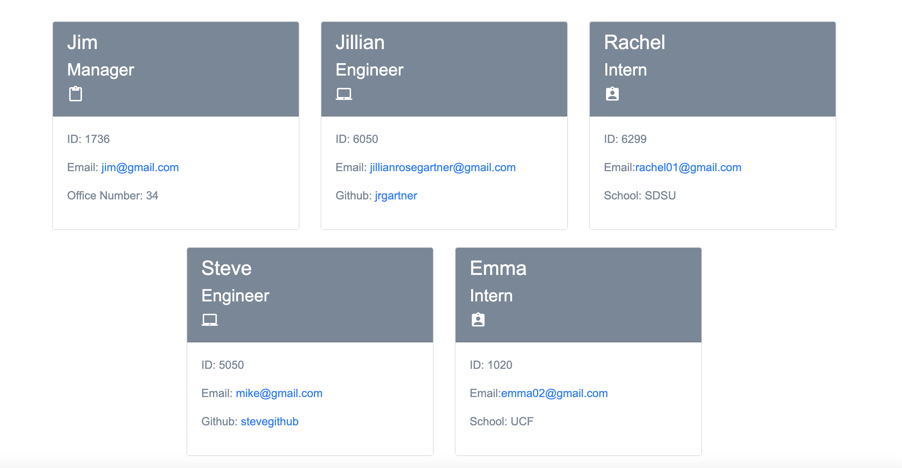

# Team Profile Generator

Screenshot of the team profile cards.

Link to video on Google Drive:
https://drive.google.com/file/d/1nO98XFGlqASsS3IyQ4rjMTpxCwmeyiAp/view?usp=sharing

## Description

A team profile generator that uses Node.js and Javascript. This also has students test their code. The team cards will display on an HTML page using bootstrap CSS.

## Table of Contents

- [Installation](#installation)
- [Usage](#usage)
- [License](#license)
- [Contributing](#contributing)
- [Tests](#tests)

## Installation

The user should clone the repository from GitHub and download Node. This application also requires a file system and inquirer module. If testing is required, this application uses Jest.

## Usage

Use the integrated terminal to answer the prompts and view in the index.html

## License

License idk

## Contributing

Contributors include Trilogy for the homework assignment.

## Tests

Run `npm test` to run Jest for tests on constructors.
